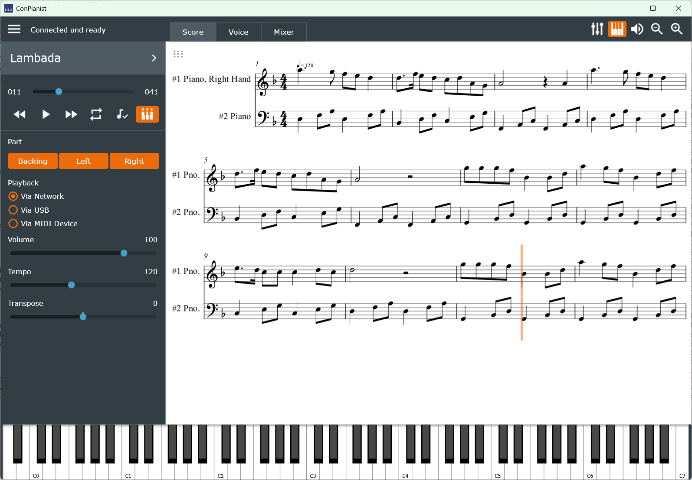
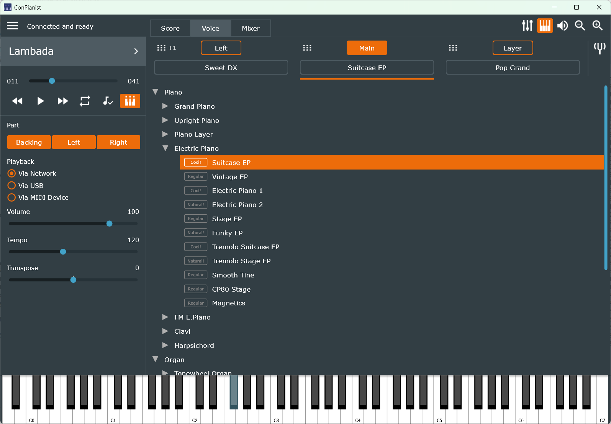
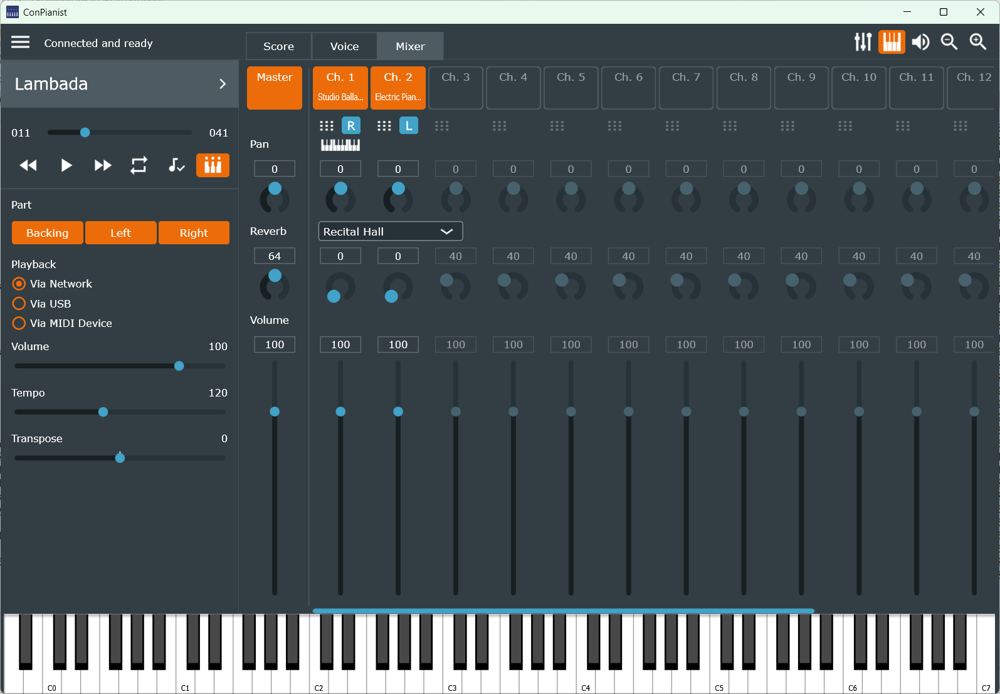

# ConPianist

> **This is a personal fork** by [Viktor318](https://github.com/Viktor318/conpianist) of the original project [hugbug/conpianist](https://github.com/hugbug/conpianist), maintained for a Yamaha CSP-170. The main documentation of this fork is in Hungarian ([README.md](README.md)); the text below is the original English README.
>
> **New in this fork** (see [CHANGELOG.md](CHANGELOG.md), in Hungarian):
> - bilingual user interface (English/Hungarian), switchable in the main menu (LANGUAGE);
> - the voices of the song's MIDI channels can be changed in the mixer, and they are saved in the registration memory (`.conmem`);
> - songs can also be played over USB without Wi-Fi, using ConPianist's own player; the player (the piano's own via the network, or ConPianist's via USB) can be chosen in the Playback section of the left panel;
> - songs can also be played on another MIDI device (MIDI Out, e.g. via loopMIDI to a software instrument such as Cantabile) – automatically when the piano is not available, or chosen in the Playback section; the mixer then uses standard MIDI controllers and General MIDI voices, and a secondary input (MIDI In 2) is played through to MIDI Out;
> - the played notes are shown on the virtual keyboard, which can be resized;
> - Live Play with the virtual keyboard and MIDI In 2, with the transposition applied: either on the piano's own keyboard parts (the Voice tab settings: Main, Layer, Left with the split point) or on one or more (layered) mixer channels – also on channels not used in the song, with their own voice, volume, pan, reverb and a per-channel octave;
> - recording of Live Play in a separate window that can stay open (main menu → Recording...): the virtual keyboard, MIDI In 2, the piano's own keys and the piano's accompaniment (style), started automatically (on the first note, stopped after silence) or manually, with metronome, bell and count-in; the recording can be listened back, optionally quantized, and saved as a standalone MIDI file with its voices and mixer settings, the key, the recognised chords, the tempo changes and the voice names of the tracks (the piano's own keys are not recorded while Smart Pianist is connected too, because the piano does not send them over USB then);
> - an Accompaniment window (main menu → Accompaniment...) to control the piano's accompaniment (style): start and stop, Sync Start, the sections (Intro 1–3, Main A–D, Fill In, Break, Ending 1–3, Auto Fill), tempo with Tap Tempo, accompaniment volume, the recognised chord spelled in the (major or minor) key of the piece, keyboard shortcuts; all 470 styles of the piano are chosen by category from a list built into the program, shown with their type and time signature, with a time signature filter; chord detection area (Full/Lower) and split point, which can also be given by pressing a key; eight registration memories (style, tempo, key, the keyboard parts, the accompaniment mixer) with optional names, recalled with F1–F8;
> - an accompaniment mixer window for the eight parts of the accompaniment (Rhythm 1–2, Bass, Chord 1–2, Pad, Phrase 1–2): on/off, volume, pan, reverb, with the name of the part's voice; a double click sets a control back to the style's own value;
> - the Balance window stays open like the other windows and has a Style strip for the whole accompaniment;
> - the XG, GM2 and GS voices of the piano can be chosen in the mixer channel menu, with their exact names;
> - a separate transpose setting for the piano's keyboard in Piano Room;
> - in the mixer channel menu: take the voice and settings of a keyboard part (Main / Layer / Left) from the Voice tab, and reset a channel;
> - switching the player keeps the mixer and left-panel settings; between the piano and a MIDI device, voices are mapped to their Yamaha ↔ General MIDI equivalents;
> - the program starts in the state it was closed in (playback output, voices, Piano Room, balance, accompaniment, mixer, Playback panel, song, position – saved to `LastState.conmem`), and remembers the positions of its windows;
> - holding the rewind / forward button for 1 second jumps to the beginning / last measure of the song;
> - the connection recovers by itself after the USB cable is plugged in again; "Reset Connection" also reopens the MIDI device and rechecks the network;
> - builds with current tools (Visual Studio 2026, recent JUCE, vcpkg); several crash and freeze fixes (including threading).
>
> A ready-to-run Windows (64-bit) build is available on the [Releases](https://github.com/Viktor318/conpianist/releases) page: unzip it to any folder and start `ConPianist.exe` (the `Resources` folder and the `.dll` files must stay next to the `.exe`). The default folder for songs, scores and `.conmem` files is `%APPDATA%\ConPianist\Demo Midi Songs`; it is worth copying the contents of the included `Demo Midi Songs` folder there.
>
> **Planned:** the plan of the next versions is in [docs/Tervek.md](docs/Tervek.md) (in Hungarian). Next: the list of the piano's built-in songs with a song selector, then a MIDI setup editor (editing and saving the initial settings of a loaded MIDI file), then improvements of the score display.

**ConPianist** or **Connected Pianist** is an app to control Yamaha digital pianos of CSP (Clavinova Smart Piano) series. This is an alternative to Yamaha's own app "Smart Pianist". Unlike Smart Pianist, which works on iOS and Android, Connected Pianist is designed for desktop systems - macOS, Windows and Linux. It works on iPad too though.

## Features

The program is not an adequate replacement for the official app yet. Nonetheless the program already can:
- connect to piano via network or cable;
- connect/reconnect without losing piano state: the program reads whole piano state on start and indicates it in the UI;
- upload midi-files to piano via network (but can't upload via USB cable);
- playback control of uploaded midi-files: start, pause, position;
- stream lights control: on, off, slow, fast;
- guide mode control: on, off, guide mode;
- select parts: backing, right hand, left hand;
- playback selected fragment in a loop;
- volume, tempo, transpose;
- select voices (all seven hundreds) for main, left and layer;
- octave shift and split point (main/left) setting;
- mixer with all classic functions: midi-channels on/off, volume, pan, reverb, reverb effect;
- extra functions in mixer: part selection for midi-channels, voice selection directly from midi-channels;
- balance for main/left/layer/song/mic/auxin: volume, pan, reverb, reverb effect;
- show scores with correct playback position: scores must be provided in a separate muscixml-file (can't show scores directly from midi-file);
- registration memory (settings) associated with midi-songs.

## Screenshots

## Acknowledgements

The source code of ConPianist includes following libraries:
- [Lomse](https://github.com/lenmus/lomse) to display scores;
- [Arduino AppleMIDI Library](https://github.com/lathoub/Arduino-AppleMIDI-Library) to communicate with piano via network.
