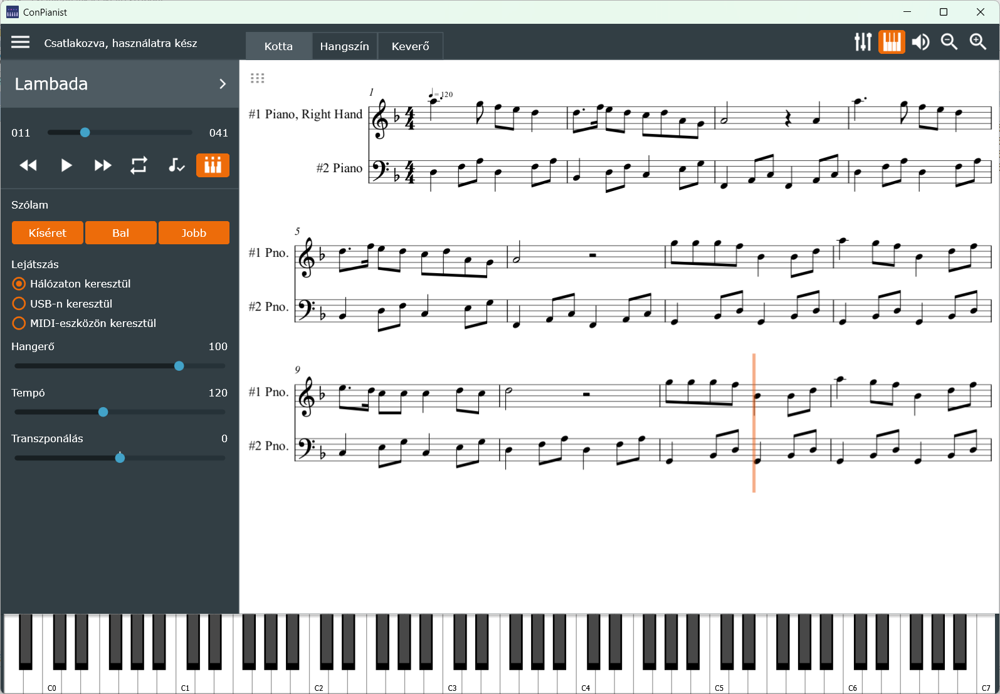
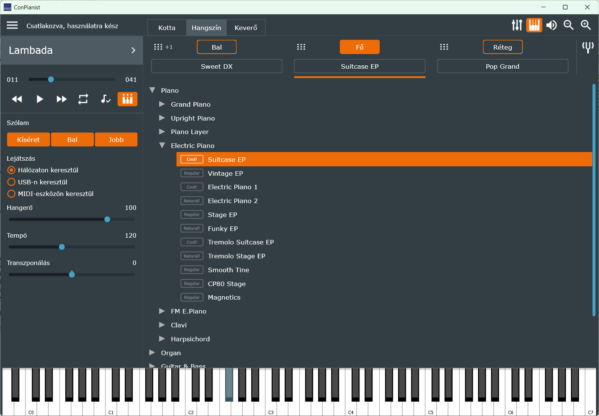
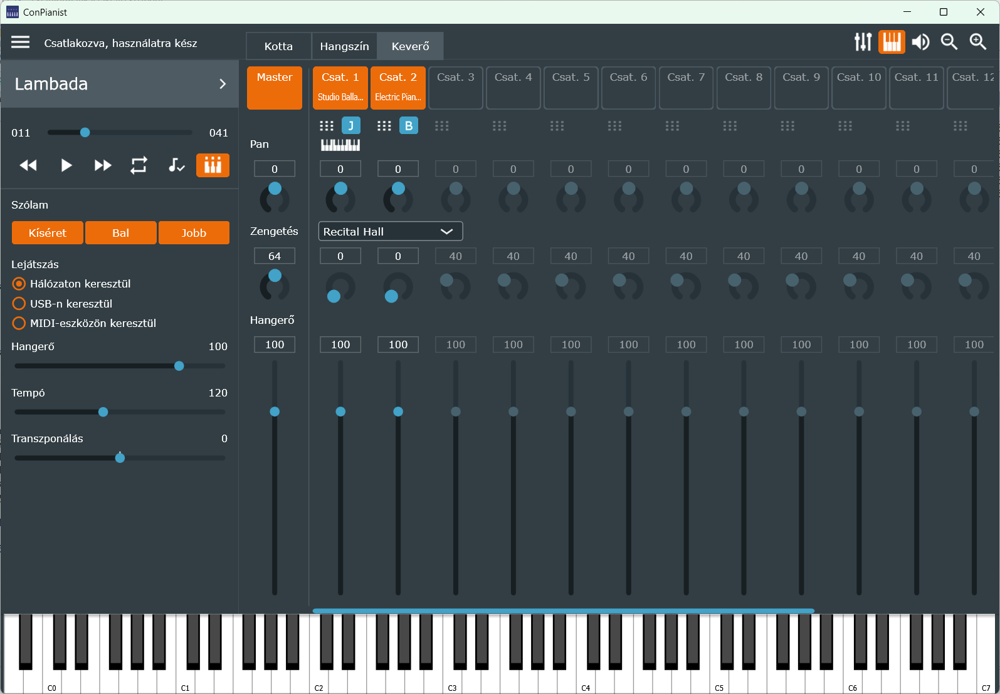

# ConPianist

> Ez ennek a projektnek **[Viktor318](https://github.com/Viktor318/conpianist) általi saját fork-ja**, saját célú, magánhasználatú továbbfejlesztésre. Az eredeti projekt: [hugbug/conpianist](https://github.com/hugbug/conpianist). Az angol nyelvű eredeti README a [README.en.md](README.en.md) fájlban található.

**ConPianist**, vagyis **Connected Pianist**, egy alkalmazás a Yamaha CSP (Clavinova Smart Piano) sorozatú digitális zongorák vezérlésére. Alternatívája a Yamaha saját "Smart Pianist" alkalmazásának. A Smart Pianist-tel ellentétben, ami iOS-en és Androidon fut, a Connected Pianist asztali rendszerekre készült — macOS, Windows és Linux alá. iPad-en is működik.

## Letöltés

A lefordított, Windowson (64 bit) futtatható változat a [Releases](https://github.com/Viktor318/conpianist/releases) oldalon található. A ZIP-fájlt egy tetszőleges mappába kell kicsomagolni, és a `ConPianist.exe`-t elindítani. A `Resources` mappának és a `.dll` fájloknak az `.exe` mellett kell maradniuk. A dalok és kották megnyitása, valamint a `.conmem` fájlok mentése és betöltése alapból a `%APPDATA%\ConPianist\Songs` mappában indul (a két csoport a saját, utoljára használt mappáját megjegyzi); a felvételek a `Songs\User Songs\Recorded Songs` mappába kerülnek. A ZIP-ben lévő `Demo Midi Songs` mappa tartalmát érdemes a `%APPDATA%\ConPianist\Songs\Demo Midi Songs` mappába másolni.

## Funkciók

A program egyelőre nem teljes értékű helyettesítője a hivatalos alkalmazásnak. Ennek ellenére már most is tud:
- csatlakozni a zongorához hálózaton vagy kábelen keresztül;
- állapotvesztés nélkül csatlakozni/újracsatlakozni: a program indításkor beolvassa a zongora teljes állapotát, és megjeleníti a felületen;
- **ugyanabban az állapotban indulni, ahogy bezárták**: bezáráskor a program elmenti a lejátszási módot, a hangszíneket, a Piano Room és a hangerőegyensúly beállításait, a kíséret beállításait (stílus, tempó, akkordfelismerés, split pont, a kíséret keverője), a Keverőt, a Lejátszás panelt, a betöltött dalt és a dalban elért pozíciót, és a következő indításkor ezeket visszaállítja; az ablakok helyét is megjegyzi;
- MIDI-fájlokat feltölteni a zongorára hálózaton keresztül;
- **MIDI-fájlokat lejátszani USB-kábelen keresztül is, Wi-Fi nélkül**: ilyenkor a ConPianist saját lejátszója játssza a dalt (tempó, transzponálás, ismétlés, szólamok, kotta szinkron működik; Stream Lights és Segéd nem). A bal panel Lejátszás részében választható, hogy a zongora saját lejátszója (hálózaton keresztül) vagy a ConPianist lejátszója (USB-n keresztül) játsszon; a választást a program megjegyzi;
- **MIDI-fájlokat lejátszani más MIDI-eszközre is** (pl. loopMIDI-n keresztül szoftveres hangszerre, például a Cantabile-be): a Kapcsolat beállításaiban a MIDI Out és a MIDI In 2 állítható be; ha a zongora nem érhető el, a lejátszás automatikusan a MIDI-eszközre vált, a zongora mellett pedig a Lejátszás részben kézzel is választható. A Keverő ilyenkor szabványos MIDI-vezérlőket és General MIDI hangszíneket használ, a virtuális billentyűzet és a MIDI In 2 a Keverőben kiválasztott élő játék csatornákon (akár többön, rétegezve) szól, a beállított transzponálással;
- a lejátszó váltásakor (hálózat, USB, MIDI-eszköz) megtartani a Keverő és a bal panel beállításait; a zongora és a MIDI-eszköz között a hangszínek a Yamaha ↔ General MIDI megfelelőjükre váltanak;
- a feltöltött MIDI-fájlok lejátszását vezérelni: indítás, szünet, pozíció; ugrás ütemenként, a tekerőgombokat 1 másodpercig nyomva pedig a dal elejére, illetve az utolsó ütemre;
- a "stream lights" (billentyű-kivilágítás) vezérlése: ki, be, lassú, gyors;
- a segéd (vezetett gyakorlás) mód vezérlése: ki, be, mód kiválasztása;
- részek kiválasztása: kíséret, jobb kéz, bal kéz;
- kiválasztott szakasz lejátszása ismétlődő (loop) módban;
- hangerő, tempó, transzponálás beállítása;
- hangszínek kiválasztása (mind a hétszáznál is több) a fő, bal kezes és réteg (layer) hangokhoz;
- oktáveltolás és osztáspont (fő/bal) beállítása;
- keverő az összes klasszikus funkcióval: MIDI-csatornák ki/be kapcsolása, hangerő, pan, zengetés, zengetéstípus;
- extra funkciók a keverőben: rész-kiválasztás MIDI-csatornánként, hangszín kiválasztása közvetlenül a MIDI-csatornákból;
- **a zenedarab csatornáinak hangszínét módosítani a keverőben** (pl. a jobb és bal kéz szólamát más hangszínen hallgatni): a panel hangokon kívül a zongora **XG, GM2 és GS hangszínei** is választhatók, pontos névvel;
- **virtuális billentyűzet**: átméretezhető (a felette lévő vonal húzásával), USB-s és MIDI-eszközös lejátszásnál mutatja a jobb és bal kéz szólamának lejátszott hangjait;
- **élő játék** a virtuális billentyűzettel és egy második MIDI-bemenettel (MIDI In 2), a beállított transzponálással: vagy a zongora saját hangján (a Hangszín fül beállításaival: Fő, Réteg, Bal kéz az osztásponttal), vagy a Keverőben kiválasztott egy vagy több csatornán (rétegezve) – a dalban nem használt csatornákon is, saját hangszínnel, hangerővel, pannal, zengetéssel és csatornánkénti oktávval; a Hangszín fül szólamainak beállításai egy kattintással átvehetők a Keverő csatornáira;
- **élő játék felvétele** külön, nyitva tartható ablakban (Főmenü → Felvétel…): felveszi a virtuális billentyűzetet, a MIDI In 2-t, a zongora saját billentyűit és a zongora kíséretét (stílus), automatikus (első hangra induló, csend után leálló) vagy kézi indítással, metronómmal, csengővel és beszámolással; a felvétel visszahallgatható, mentéskor kvantálható, és a hangszínekkel, keverőbeállításokkal együtt önálló MIDI-fájlba menthető, amelyből kottaszerkesztővel (pl. Dorico, MuseScore) kotta készíthető; a fájlba bekerül a beállított hangnem, a felismert akkordok, a tempóváltások és a sávok hangszínneve is. Amíg a Smart Pianist is csatlakozik a zongorához, a zongora saját billentyűi nem kerülnek a felvételbe, mert a zongora ilyenkor nem küldi őket USB-n;
- **a zongora kíséretének (stílus) vezérlése** külön, nyitva tartható ablakban (Főmenü → Kíséret…): indítás és leállítás, Sync Start, a szakaszok (Intro 1–3, Main A–D, Fill In, Break, Ending 1–3, Auto Fill), tempó Tap Tempóval, a kíséret hangereje, a felismert akkord kijelzése a darab (dúr vagy moll) hangneme szerint, gyorsbillentyűk; a zongora mind a 470 stílusa kategóriák szerint választható a programba épített listából, a név mellett a stílus típusával és ütemmutatójával, ütemmutató szerinti szűrővel; akkordfelismerés (Full/Lower) és split pont, a billentyűről is megadható; **nyolc regisztrációs memória** (stílus, tempó, hangnem, a billentyűzet szólamai, a kíséret keverője) saját névvel, F1–F8 gyorsbillentyűvel;
- **kíséret keverő** külön ablakban a kíséret nyolc szólamához (Rhythm 1–2, Bass, Chord 1–2, Pad, Phrase 1–2): be- és kikapcsolás, hangerő, tér, zengetés, a szólam hangszínének nevével; dupla kattintás a stílus saját értékére állít vissza;
- hangerőegyensúly (balansz) beállítása külön, nyitva tartható ablakban a stílus/fő/bal/réteg/dal/mikrofon/aux in csatornákra: hangerő, tér, zengetés, zengetéstípus;
- **Piano Room**: a zongora hangzásának finomhangolása — fedél helyzete, fényesség, környezet (zengetés), billentés érzékenysége, hangolás, virtuális rezonanciamodellezés (VRM), tompító- és húrrezonancia, billentyűfelengedési hang;
- kották megjelenítése a lejátszási pozícióval szinkronban: a kottákat külön MusicXML-fájlban kell megadni (közvetlenül a MIDI-fájlból nem jeleníthető meg kotta);
- a regisztrációs memória (beállítások) MIDI-dalokhoz rendelése, **a zenedarab csatornáinak saját hangszíneivel együtt**;
- **kétnyelvű (magyar/angol) kezelőfelület** — a nyelv a Főmenü → NYELV / LANGUAGE pontban váltható.

## Képernyőképek

## Köszönetnyilvánítás

A ConPianist forráskódja a következő könyvtárakat tartalmazza:
- [Lomse](https://github.com/lenmus/lomse) a kották megjelenítéséhez;
- [Arduino AppleMIDI Library](https://github.com/lathoub/Arduino-AppleMIDI-Library) a zongorával való hálózati kommunikációhoz.

## Erről a fork-ról

Ez a változat saját, magáncélú felhasználásra készül egy Yamaha CSP-170 zongorához, modern fejlesztői eszközökkel (Visual Studio 2026, friss JUCE, vcpkg) újra buildelve. Az eredeti programhoz képest a legfontosabb változások:
- kétnyelvű (magyar/angol) kezelőfelület, a szakkifejezések a CSP-170 magyar használati útmutatóját követik;
- a zenedarab csatornáinak hangszíne módosítható a keverőben, és a regisztrációs memóriába is mentődik;
- zenedarab lejátszása USB-n keresztül, Wi-Fi nélkül, a ConPianist saját lejátszójával; a lejátszó a bal panelen választható;
- lejátszás más MIDI-eszközre is (pl. loopMIDI → Cantabile), zongora nélkül, General MIDI hangszínekkel;
- a lejátszott hangok megjelennek a virtuális billentyűzeten, amely át is méretezhető;
- élő játék a virtuális billentyűzettel és a MIDI In 2-vel, transzponálással: a zongora saját hangján (Hangszín fül) vagy a Keverő csatornáin (rétegezve, a dalban nem használt csatornákon is, csatornánkénti oktávval);
- a Keverő csatornamenüjében hangszín átvétele a Hangszín fülről, és Alaphelyzet csatornánként;
- élő játék felvétele MIDI-fájlba metronómmal, beszámolással, visszahallgatással és kvantálással;
- Kíséret ablak a zongora kíséretének (stílus) vezérléséhez, a Smart Pianistből el nem érhető Intro 2–3 és Ending 2–3 szakaszokkal, beépített stíluslistával, ütem szűrővel, akkordfelismerés- és split pont beállítással, nyolc regisztrációs memóriával;
- kíséret keverő a kíséret nyolc szólamához, és nyitva tartható Hangerőegyensúly ablak Stílus csíkkal;
- a felvett MIDI-fájlba bekerül a hangnem, az akkordok, a tempóváltások és a sávok hangszínneve;
- a zongora XG, GM2 és GS hangszínei a Keverő menüjében, pontos névvel;
- a zongora billentyűzetének külön transzponálása a Piano Roomban;
- indulás a bezáráskori állapotban (lejátszási mód, hangszínek, kíséret, Keverő, dal, pozíció, az ablakok helye), a lejátszó váltásakor pedig a beállítások megmaradnak;
- ugrás a dal elejére és végére a tekerőgombok hosszan nyomásával;
- a kapcsolat az USB-kábel visszadugása után magától helyreáll;
- több összeomlás és lefagyás javítása (dalszöveget tartalmazó kották, MIDI-feltöltés, hálózati csatlakozás, szálkezelés);
- apróbb kényelmi javítások, pl. rákérdezés létező fájl felülírása előtt.

A részletes változáslista a [CHANGELOG.md](CHANGELOG.md) fájlban található.

**Tervezett fejlesztés:** a következő verziók terve a [docs/Tervek.md](docs/Tervek.md) fájlban található. A soron következő csomag a zongora beépített dalainak listája és a dalválasztó, utána a MIDI áthangszerelő (a betöltött MIDI-fájl kezdeti beállításainak szerkesztése és mentése), majd a kottakezelés fejlesztése.
